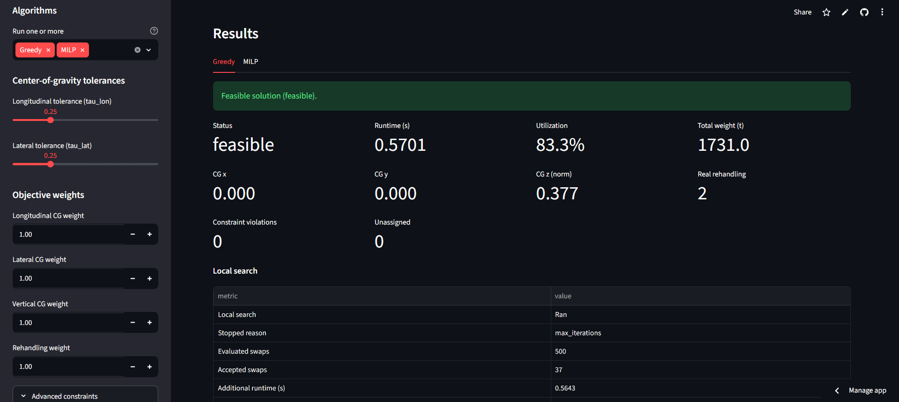

# Container Ship Stowage Optimizer

A Python + Streamlit optimization app for building and comparing container ship
stowage plans. It assigns containers to vessel slots, checks operational
constraints, evaluates center of gravity and rehandling, and compares exact and
heuristic solvers through a shared metrics layer.

**Live app:** [container-ship-stowage-optimizer.streamlit.app](https://container-ship-stowage-optimizer.streamlit.app/)

**Status:** All roadmap phases completed, including post-MVP phases 9 through
14: quality tooling, deployment readiness, MILP incumbent recovery,
scenario/result import-export, visual diagnostics, Local Search post-processing,
and an Academic guide learning mode.


## What It Does

The app takes:

- a simplified vessel grid defined by `(bay, row, tier)`;
- a container list with weight, destination port, and cargo type;
- a port route;
- solver and objective settings.

It produces:

- a final stowage plan;
- feasibility and constraint diagnostics;
- center-of-gravity metrics;
- real rehandling by port-by-port unloading simulation;
- 3D layout visualization;
- algorithm comparisons;
- downloadable CSV and JSON artifacts.

The project is academic in scope: it is designed to be explainable, testable,
and reproducible, not to replace certified industrial stowage software.

## Highlights

- Greedy constructive baseline.
- MILP exact reference solver with CBC/PuLP and time-limited incumbent recovery.
- Genetic Algorithm metaheuristic for larger search spaces.
- Optional swap-based Local Search after Greedy or GA.
- Shared metrics engine for fair algorithm comparison.
- Horizontal and vertical center-of-gravity diagnostics.
- Real rehandling simulation by route order.
- Plotly 3D stowage visualization.
- Scenario JSON import/export.
- Result CSV downloads.
- Bundled example datasets.
- Academic guide with plain-language and technical explanations.
- Ruff, pytest, coverage, CI, and Streamlit Cloud deployment readiness.

## Screenshots

### Optimizer workflow



### 3D stowage plan


### Visual diagnostics


### Academic guide


## Algorithms At a Glance

| Algorithm | Role | Best for | Notes |
| --- | --- | --- | --- |
| Greedy | Fast constructive baseline | Quick feasible plans | No optimality guarantee. |
| MILP | Exact reference | Small instances | Optimal for its mathematical formulation. |
| Genetic Algorithm | Metaheuristic search | Medium/larger scenarios | Reproducible with a fixed seed. |
| Local Search | Swap post-processing | Improving Greedy/GA plans | Preserves hard constraints. |

Raw internal objective values are not compared directly across algorithms.
Instead, every final plan is evaluated with the same metrics engine.

## Core Metrics

| Metric | Meaning |
| --- | --- |
| `CG_x` | Longitudinal center of gravity. |
| `CG_y` | Lateral center of gravity. |
| `CG_z_normalized` | Vertical loading quality proxy. |
| `real_rehandling` | Blocking moves from simulated unloading. |
| `constraint_violations` | Structural hard-constraint violations. |
| `slot_utilization` | Occupied slots divided by total slots. |

## Tech Stack

- Python
- Streamlit
- PuLP / CBC
- Plotly
- pandas
- pytest
- coverage
- ruff
- GitHub Actions

## Quickstart

Clone the repository, install dependencies, and run the app.

Windows / PowerShell:

```powershell
python -m venv .venv
.\.venv\Scripts\Activate.ps1
python -m pip install --upgrade pip
pip install -r requirements.txt
pip install -e .
powershell -ExecutionPolicy Bypass -File .\run_app.ps1
```

macOS / Linux:

```bash
python -m venv .venv
source .venv/bin/activate
python -m pip install --upgrade pip
pip install -r requirements.txt
pip install -e .
streamlit run app/main.py
```

To run tests, linting, or benchmarks, also install the dev tools:

```bash
pip install -e ".[dev]"
```

Run checks (any OS):

```bash
python -m ruff check .
python -m pytest --cov=stowage_optimizer --cov=app --cov-report=term-missing
```

Run benchmarks (any OS):

```bash
python -m stowage_optimizer.benchmarks.runner
```

The PowerShell helper scripts (`run_app.ps1`, `run_tests.ps1`) remain an
optional Windows convenience.

## Documentation

| Document | Purpose |
| --- | --- |
| [User Guide](./docs/USER_GUIDE.md) | How to use the Streamlit app and interpret outputs. |
| [Algorithms](./docs/ALGORITHMS.md) | Greedy, MILP, GA, and Local Search overview. |
| [Metrics and Constraints](./docs/METRICS_AND_CONSTRAINTS.md) | Hard constraints, feasibility flags, and final metrics. |
| [Academic Explanation](./docs/ACADEMIC_EXPLANATION.md) | Modeling assumptions, limitations, and academic framing. |
| [Design Document](./docs/DESIGN.md) | Detailed mathematical and technical design. |
| [Benchmarks](./docs/BENCHMARKS.md) | Reproducible benchmark scenarios and outputs. |
| [Deployment](./docs/DEPLOYMENT.md) | Local operations and Streamlit Cloud deployment notes. |
| [Roadmap](./ROADMAP.md) | Completed phase-by-phase implementation plan. |

## Project Structure

```text
app/
  main.py
  app_helpers.py
  learning_content.py
src/stowage_optimizer/
  core/
  solvers/
  viz/
  benchmarks/
tests/
docs/
```

## Project Summary

This project demonstrates end-to-end optimization engineering: domain modeling,
exact and heuristic solvers, shared evaluation metrics, interactive
visualization, reproducible testing, deployment readiness, and academic
explanation of assumptions and limitations.

## License

MIT. See [LICENSE](./LICENSE).
