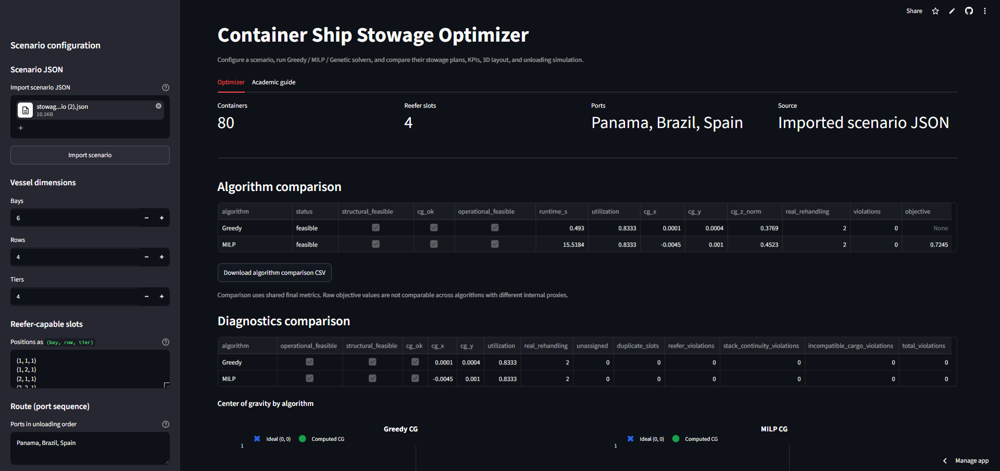
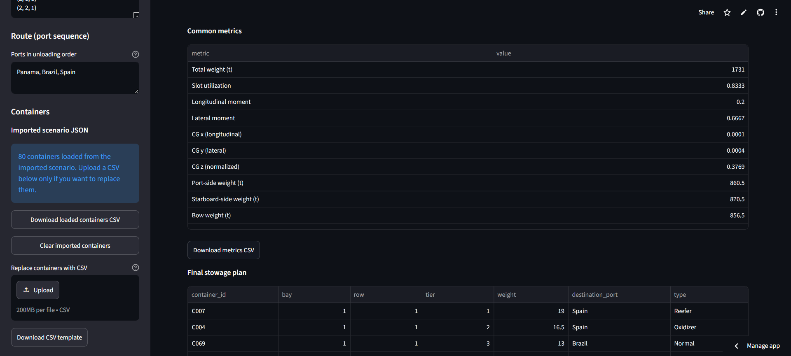
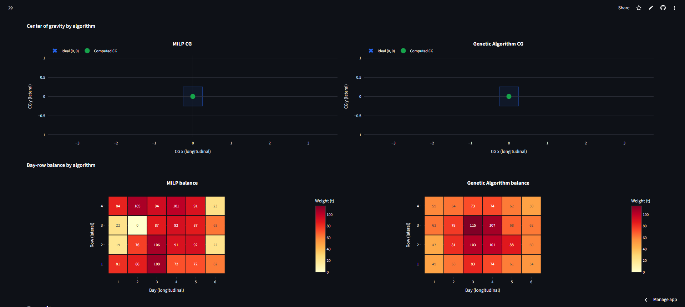
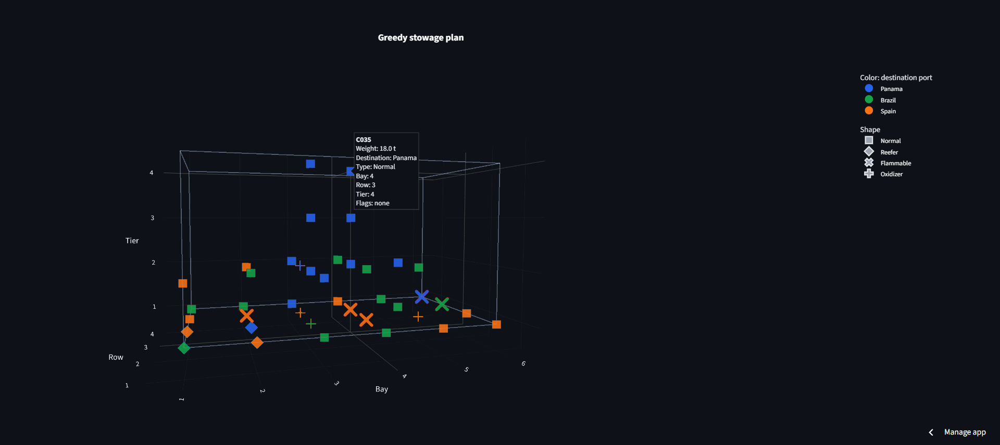
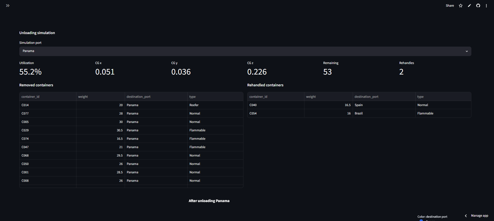
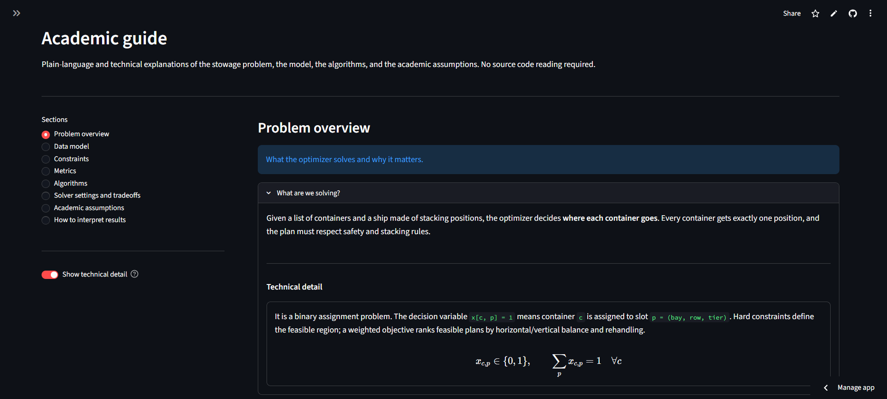

# User Guide

This guide explains how to use the Streamlit app from a user point of view:
configure a scenario, run solvers, inspect results, and export reproducible
artifacts.

For the technical model and solver formulation, see [DESIGN.md](./DESIGN.md).

## App Entry Point

Run locally with:

```powershell
powershell -ExecutionPolicy Bypass -File .\run_app.ps1
```

Or use the public Streamlit app:

[https://container-ship-stowage-optimizer.streamlit.app/](https://container-ship-stowage-optimizer.streamlit.app/)



## Basic Workflow

1. Configure the vessel grid in the sidebar.
2. Define reefer-capable slots.
3. Provide the route order.
4. Upload a container CSV or use the built-in example.
5. Select one or more algorithms.
6. Adjust solver settings if needed.
7. Run optimization.
8. Inspect KPIs, tables, diagnostics, 3D visualization, and unloading simulation.
9. Download final plans, metrics, or comparison tables.

## Vessel Configuration

The simplified vessel is a rectangular slot grid:

```text
(bay, row, tier)
```

- `bay`: longitudinal position.
- `row`: lateral position.
- `tier`: vertical stack level.

The app converts these discrete positions into normalized coordinates for
center-of-gravity calculations.

## Container Input

The CSV upload expects:

```csv
id,weight,destination_port,type
C001,28.5,Panama,Normal
C002,18.0,Brazil,Reefer
C003,24.0,Spain,Flammable
C004,16.5,Spain,Oxidizer
```

Supported types:

| Type | Meaning |
| --- | --- |
| `Normal` | Standard container. |
| `Reefer` | Requires a reefer-capable powered slot. |
| `Flammable` | Dangerous cargo class used in simplified separation rules. |
| `Oxidizer` | Dangerous cargo class incompatible with `Flammable`. |

The app validates duplicate IDs, invalid weights, unknown cargo types,
destination ports outside the route, vessel capacity, and reefer capacity before
running a solver.

## Solver Selection

The app can run one or more algorithms:

| Algorithm | Typical use |
| --- | --- |
| Greedy | Fast baseline and quick feasible plans. |
| MILP | Exact reference for small instances. |
| Genetic Algorithm | Larger search when MILP becomes expensive. |

Greedy and Genetic Algorithm can optionally run Local Search post-processing to
polish the final plan with hard-constraint-preserving swaps.

## Solver Settings

### MILP

- Time limit controls how long CBC may search.
- Objective weights control the tradeoff between horizontal CG, vertical CG, and
  the MILP rehandling proxy.
- A time-limited run may return a feasible incumbent without proving optimality.

### Genetic Algorithm

- Population size controls breadth of search.
- Max generations controls search depth.
- Mutation and crossover probabilities control exploration.
- Random seed makes runs reproducible.

### Local Search

- Max iterations limits evaluated swaps.
- Rounds without improvement stop the search when progress stalls.
- Optional time limit caps post-processing runtime.

## Results

The result page shows:

- solver status;
- runtime;
- utilization;
- total weight;
- `CG_x`, `CG_y`, and normalized `CG_z`;
- real rehandling;
- structural violations;
- unassigned containers.

The screenshot below focuses on the common metrics table and final stowage plan
table.



## Diagnostics

Diagnostics help explain why a plan is good, weak, or infeasible:

- bay-row weight balance heatmap;
- center-of-gravity plot with tolerance box;
- readable violation explanations;
- side-by-side algorithm comparison when multiple solvers run.



## 3D Stowage View

The Plotly 3D view displays the final stowage plan with hoverable container
metadata. It can color containers by destination port or cargo type.



## Unloading Simulation

The app simulates unloading port by port. It identifies containers removed at
each stop and counts blocking moves as real rehandling.



## Import and Export

The app supports:

- scenario JSON export;
- scenario JSON import;
- final stowage plan CSV download;
- final metrics CSV download;
- algorithm comparison CSV download;
- bundled example datasets for 20, 40, 60, and 80 containers.

Scenario JSON includes vessel dimensions, route, containers, reefer
configuration, tolerances, objective weights, algorithm choices, and solver
settings.

## Academic Guide

The app includes an Academic guide tab with plain-language and technical
explanations of:

- the stowage problem;
- vessel and container data model;
- hard constraints;
- final metrics;
- Greedy, MILP, Genetic Algorithm, and Local Search;
- solver settings and tradeoffs;
- assumptions and limitations.


